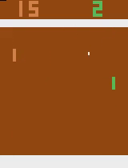
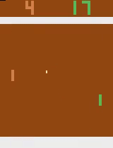
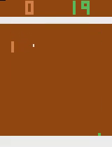
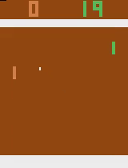

## Value-based Reinforcement Learning on Atari Games

> Tensorflow implementation of Deep Q Network (DQN) performed on Atari Pong Game

In this project, I explore the typical value-based RL algorithm which called DQN. I do experiments on DQN in Atari environments Pong. In theory, this code can work on other Atari environments that return images as observations, but re-tuning hyperparameters may be necessary. 


|  |  |  |  |
| :----------------------------------: | :---------------------------------------------------: | :---------------------------------------------------: | :---------------------------------------------------: |
|             Random model             |                   DQN 5260000 steps                   |                   DQN 8090000 steps                   |                   DQN 9500000 steps                   |


### Dependencies

* python 3.7.7
* numpy
* tensorflow 2.0.0
* pandas
* bokeh
* opencv-python
* gym

Type the following command to install OpenAI Gym Atari environment.

`$ pip install opencv-python gym gym[atari]`

Please refer to [OpenAI's page](https://github.com/openai/gym) if you have any problem while installing.


### Usages

Train DQN with the default arguments on gym Atari environments:

`$ python run_dqn_atari.py >> train_logs_new.log`


There is a jupyter notebook, named ```DQN_results_summary.ipynb```, which has all the code for plotting the stats presented in the report. The file named ```DQN_results_summary.html``` is the html snapshot of the jupyter notebook. 


